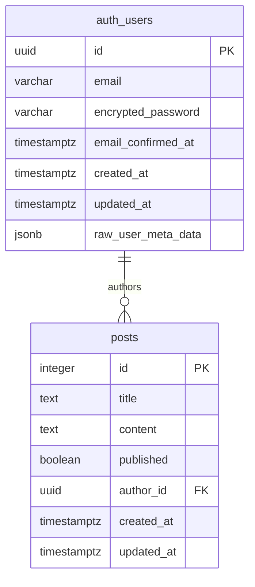

# Database Schema

---

## ER Diagram

---

## Description

The system centers around two main entities: users and their posts. When a user signs up through Supabase Auth, they get an account in the `auth_users` table with a unique UUID. They can then create multiple blog posts, each linked to their user ID through the `author_id` foreign key.

This relationship enables personalized experiences - users can view and manage only their own posts, while still allowing others to read published content. The Row Level Security policies ensure data isolation, so Jane can only edit her own posts, but everyone can read them if they're published. This design supports features like personal dashboards, author profiles, and content management while maintaining security boundaries.
